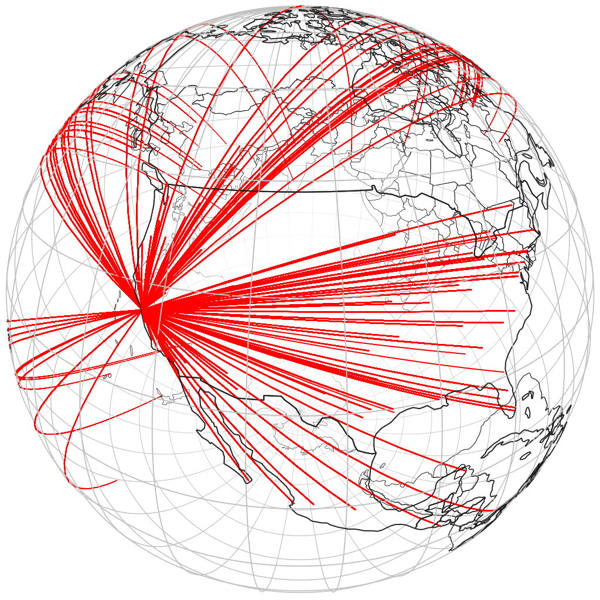

# go-sfomuseum-flights-globe

Experimental code for generating globe-like pictures from SFO Museum flight data


## Example

```
go run cmd/globe/main.go -latitude 39.864939 -longitude -104.672219 /usr/local/data/sfomuseum-data-flights-2019-06/
```

Which would produce:



## See also:

* https://github.com/mmcloughlin/globe
* https://github.com/sfomuseum-data/?q=sfomuseum-data-flights